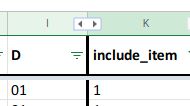

# Spreadsheet content

-   For each item:

    -   Give it an item name
    -   Create a specific unambiguous question
    -   Identify the response type expected (based on exemplary software)
    -   Determine which softwares are considered in the examples
    -   Create a response choice list where needed
    -   Check if the item can be extracted from a BIDS data set

-   Identify high-priority items that will be in the next release of the app.
-   For each item:

    -   Give it a unique item name (a formula in the MRI spreadsheet should
        automatically take care of that)
    -   Create a specific unambiguous question
    -   Add details and explanation to that item, possibly with examples and/or
        links to other resources to best guide users
    -   Identify the response type expected
    -   Create a response choice list where needed
    -   Assess whether there is way to not expose users to that item (or some of
        the response choice for that item) if it is not relevant to them
        -   by answering another question that would select which following
            items to show (e.g. 'which preprocessing steps were used?')
        -   if some response choice are not available for that item based on
            some previous answer

-   you can find them in this
    [google drive folder](https://drive.google.com/drive/folders/1wg5k-6pSB3mQm_a30abX6qb-lzTn_S-Y?usp=sharing).
-   the MRI spreadsheet is accessible
    [here](https://docs.google.com/spreadsheets/d/1dCXP0MTK3DjY09ZFd7FXgv0Ngx16_YJwVBiXOeQbTho/edit?usp=sharing)
-   the MEEG spreadsheet is accessible
    [here](https://docs.google.com/spreadsheets/d/1OhkmbtgIWdFxSVjpu6A8PWoAuqev0jY-98GFQlwBCy0/edit?usp=sharing)

The spreadsheets (found
[here](https://drive.google.com/open?id=1ydwALHDzl21dcef3qhkju8JKKAT3Y72V))
contain all relevant information needed to develop the
[COBIDAS app](https://cobidas-checklist.herokuapp.com/#/) further. The aim is to
have one COBIDAS checklist item (one question) per row. In general, it is
recommended to NOT hide rows but instead to filter using some of the columns.

The MRI spreadsheet has some conditional formatting implemented so some cells
will appear red when there is an error to be fixed. Some items that require more
work might be manually highlighted in orange.

Here follows a description of the columns' content. If some columns do not
appear, it is possible that they have been hidden by someone else. You will
simply have to click on the double black arrow at the limit between columns to
display them back.

## Referencing

The first few columns are only there to try in the future to create a unique
code identifier for each item.

| Apdx | Act | A1  | A2  | A3  | A4  | A5  | Ref1 | D   | Reference |
| ---- | --- | --- | --- | --- | --- | --- | ---- | --- | --------- |

**This is low priority at the moment so those columns are hidden most of the
time.**

## Filtering

The following columns can be used to filter which item to display, using the
arrow at the top of the cells.

| include_item                                                     | neurovault_or_carp                                                                                                                                                                                | mandatory                                                  |
| ---------------------------------------------------------------- | ------------------------------------------------------------------------------------------------------------------------------------------------------------------------------------------------- | ---------------------------------------------------------- |
| items that include items from `neurovault_or_carp` and some more | items that have their counterpart in the neurovault metadata list and/or that were surveyed by [Carp in 2012](https://drive.google.com/file/d/1TBSxC52kXVERl9JmfbBPC7uCas4QN_vg/view?usp=sharing) | items labelled as mandatory in the original COBIDAS report |

{>>Some of the choices for the items to include have been made in a pretty
arbitrary and one sided manner. This should be discussed further before moving
on.<<}

## Schema activity name

| activity_name                                                                      |
| ---------------------------------------------------------------------------------- |
| This corresponds to the main section headings found in the original COBIDAS report |

The `activity_name` column can also be filtered using the arrow at the top of
the cell in order to see only the items corresponding to one or more main
sections (e.g., "Acquisition", "Experimental design", "Preprocessing", etc.).

{>>This might need some discussion too: it is possible that we might gain from
splitting some of those into smaller sub-sections.<<}

## Item name

The `aspect` columns allow for a human readable atomization of each section into
items that are organized in a hierarchical fashion (from a general aspect
description to more specific specifications). For example:

| aspect_1        | aspect_2                                | aspect_3                     | aspect_4          | aspect_5 |
| --------------- | --------------------------------------- | ---------------------------- | ----------------- | -------- |
| MRI acquisition | Imaging type                            | partial fourrier scheme      |                   |          |
| MRI acquisition | Essential sequence & imaging parameters | All acquisitions             | voxel dimension   |          |
| MRI acquisition | Essential sequence & imaging parameters | Functional MRI               | number of volumes |          |
| MRI acquisition | Essential sequence & imaging parameters | Inversion recovery sequences | Inversion time    |          |
| MRI acquisition | Essential sequence & imaging parameters | Imaging parameters           | field of view     |          |
| MRI acquisition | Essential sequence & imaging parameters | Slice timing                 |                   |          |

Those columns are then used to create each `item_name`.

| aspect_1 | aspect_2 | aspect_3 | aspect_4 | aspect_5 | item_name                                                      | item_name_duplicate                                                                                                             |
| -------- | -------- | -------- | -------- | -------- | -------------------------------------------------------------- | ------------------------------------------------------------------------------------------------------------------------------- |
|          |          |          |          |          | is determined by the content of the right most "aspect" column | each `item_name` must be unique in the entire column: the cell turns red and displays a '1' if there is a duplicate `item_name` |

## Question and details

| question                                                                                                                                                                                                                                                                                                                                                  | details                                                                                                                                                                                                                                                        |
| --------------------------------------------------------------------------------------------------------------------------------------------------------------------------------------------------------------------------------------------------------------------------------------------------------------------------------------------------------- | -------------------------------------------------------------------------------------------------------------------------------------------------------------------------------------------------------------------------------------------------------------- |
| Each line must correspond to one checklist item that must have only one unambiguous question. Any item that opens the possibility of a response of the form "If A was used, then list the parameters B, C, D" must be broken down into several questions: "1. Was A used? 2. If so, what parameter was used for B? 3. What parameter was used for C? ..." | Some questions might require some additional information to be understandable by all users, so any extra information to be displayed to the users should be put the detail column - it is still unclear at this moment how this will be displayed to the users |

## Format

The type of answer expected must specified for each item in the column `format`.

-   char: a text answer is expected
-   boolean: a yes / no answer is expected
-   float: a numeric answer (with decimals where necessary) is expected, e.g.,
    "123.45"
-   int: an integer is expected (i.e., whole numbers)
-   choice: the user must choose one answer from a list. The last option is
    always other and opens up the possibility to give a text answer
-   multiple choice: several options can be chosen from the list

| format               | choice_levels                                             |
| -------------------- | --------------------------------------------------------- |
| format for this item | list of choices in case of `choice` and `multiple choice` |

## Visibility and branching logic

The `visibility` column lists the conditions that have to be fulfilled for each
item to be displayed to the user. By default, an item will be displayed
(visibility = 1) or will only be shown if a specific answer has been given to a
previous item.

If only an `item_name` is listed, then a positive answer must have been given to
the question corresponding to that `item_name`. Otherwise, a specific choice
must have been made on a previous question. For example:

| visibility                                                                                                                              |
| --------------------------------------------------------------------------------------------------------------------------------------- |
| operation performed = brain extraction. If the user selected the brain extraction method as the operation performed, show this question |

## Default options

Later on, it will be useful to know if some of the most commonly used software
either have

-   a "default" for some COBIDAS items (ideally, this default should be the one
    at the top of the choice list when the user has specified their software).
-   a more restricted list of choices for some items (ideally, the number of
    possibilities shown to choose from should be restricted as well). For
    example, SPM only allows 6 degrees of freedom with a set cost function for
    realignment, so there is no reason to ask the user for that info if they
    have done the realignment with SPM.

This could significantly speed things up for users

| SPM defaults     | FSL defaults     | AFNI defaults     |
| ---------------- | ---------------- | ----------------- |
| Defaults for SPM | Defaults for FSL | Defaults for AFNI |

**This is low priority at the moment so those columns are hidden most of the
time.**

## Import from other sources

These column list if the different items can be found (and where) in other
sources: a BIDS (Brain Imaging Data Structure) dataset, an NIDM (NeuroImaging
Data Model) results package or a NeuroVault collection.

| BIDS_status                                                                                                | BIDS_source | BIDS_source_field | NIDMs_results_status | neurovault              |
| ---------------------------------------------------------------------------------------------------------- | ----------- | ----------------- | -------------------- | ----------------------- |
| 0: does not exist in BIDS; 1: exist in BIDS and can be extracted; 2: could be included in BIDS; 3: unknown |             |                   |                      | item name in NeuroVault |

**This is low priority at the moment so those columns are hidden most of the
time.**

## Comparison to Carp 2012

This is for future reference: it lists the percentage of studies that reported
each item according to
[Carp, 2012](https://drive.google.com/file/d/1TBSxC52kXVERl9JmfbBPC7uCas4QN_vg/view?usp=sharing).
This could help figure out in which order items should be presented to users
(e.g., most reported items first and go down the priority list).

| in_Carp2012                                                                                                        | % of studies that informed it                                                                                                                                                                                                              | % of studies that informed it (structural) |
| ------------------------------------------------------------------------------------------------------------------ | ------------------------------------------------------------------------------------------------------------------------------------------------------------------------------------------------------------------------------------------ | ------------------------------------------ |
| item name used in [Carp, 2012](https://drive.google.com/file/d/1TBSxC52kXVERl9JmfbBPC7uCas4QN_vg/view?usp=sharing) | If the number is bold, it was approximately extracted from one of the figures of [Carp, 2012](https://drive.google.com/file/d/1TBSxC52kXVERl9JmfbBPC7uCas4QN_vg/view?usp=sharing) (because it was not reported in the text of the article) | Same, but for the structural data          |

**This could prove useful later but is low priority at the moment so these
columns are hidden most of the time.**

## Meta analysis use case

These columns denote whether or not each item could be important to evaluate
studies for a meta-analysis.

| use_case_meta-analysis                                              | meta-analysis_comment |
| ------------------------------------------------------------------- | --------------------- |
| Y: yes, include for meta-analyses; N: no, exclude for meta-analyses | relevant comments     |

**This is low priority at the moment so these columns are hidden most of the
time.**
